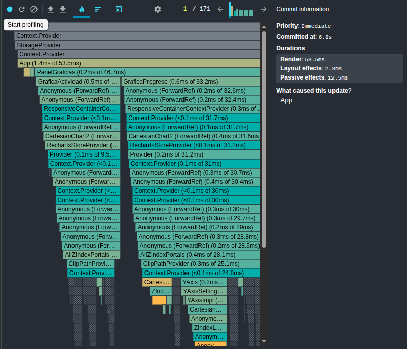
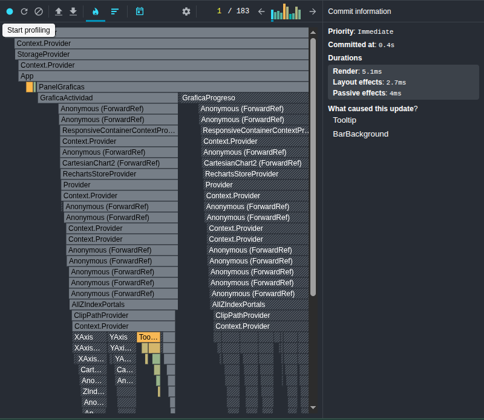

# GameTracker — Mi Colección de Videojuegos

App full-stack para rastrear mi backlog personal de videojuegos.  
Construida con React + Vite en el frontend y Node.js + Express + SQLite en el backend.

**URLs de producción (Fase 4):**
- Frontend: _pendiente (Vercel)_
- Backend: _pendiente (Render)_

---

## Capturas de pantalla

> _(Agregar capturas con 3+ juegos reales antes de entregar)_

---

## Stack tecnológico

| Capa       | Tecnología                        |
| ---------- | --------------------------------- |
| Frontend   | React 18 + Vite                   |
| Estado     | useState, useContext, useRef      |
| Estilos    | CSS puro + variables CSS          |
| Backend    | Node.js + Express                 |
| Base de datos | SQLite (`better-sqlite3`)      |
| Deploy     | Vercel (frontend) + Render (backend) |

---

## Cómo correr el proyecto localmente

### Backend

```bash
cd backend
cp .env.example .env
npm install
npm run dev
# Corre en http://localhost:3001
```

### Frontend

```bash
cd frontend
cp .env.example .env.local
npm install
npm run dev
# Corre en http://localhost:5173
```

---

## Mi paleta de colores

### Tema oscuro

| Variable               | Hex       | Justificación |
| ---------------------- | --------- | ------------- |
| `--color-fondo`        | `#0d1117` | Negro carbono tomado del tema de GitHub Dark. Evoca una pantalla apagada y reduce la fatiga visual en sesiones largas de juego nocturno. |
| `--color-superficie`   | `#161b22` | Un gris muy oscuro que levanta visualmente las tarjetas sin romper la sensación de oscuridad total. El contraste con el fondo es sutil pero suficiente. |
| `--color-superficie2`  | `#21262d` | Nivel de superficie para hover y estados activos; la progresión de tres grises crea jerarquía visual sin usar sombras fuertes. |
| `--color-texto`        | `#e6edf3` | Blanco ligeramente azulado (no puro) para reducir el contraste extremo y el cansancio ocular en temas oscuros. |
| `--color-texto-2`      | `#8b949e` | Gris medio para texto secundario como etiquetas y hints; guía la jerarquía tipográfica sin distraer. |
| `--color-acento`       | `#7c3aed` | Violeta "gaming" (purple-600 de Tailwind). Es el color asociado a plataformas como Twitch y transmite la cultura gamer sin ser agresivo. |

### Tema claro

| Variable               | Hex       | Justificación |
| ---------------------- | --------- | ------------- |
| `--color-fondo`        | `#f0f2f5` | Gris azulado muy claro inspirado en el fondo de Facebook/Meta. Más suave que el blanco puro y reduce el deslumbramiento en ambientes iluminados. |
| `--color-superficie`   | `#ffffff` | Blanco puro para las cards; contrasta limpiamente con el fondo grisáceo y comunica limpieza. |
| `--color-superficie2`  | `#e8eaed` | Gris claro para hover; da feedback visual de interacción sin un cambio de color dramático. |
| `--color-texto`        | `#1c1e21` | Negro suave (no absoluto) que evita el contraste 100% negro/blanco, más cómodo para lectura prolongada. |
| `--color-texto-2`      | `#606770` | Gris medio cálido para texto secundario en el tema claro; mantiene la jerarquía tipográfica. |
| `--color-acento`       | `#5b21b6` | Violeta más saturado (purple-800) que en el tema oscuro para mantener el contraste WCAG AA sobre fondo blanco. |

---

## Estructura del proyecto

```
├── frontend/
│   └── src/
│       ├── context/
│       │   ├── StorageContext.js      # createContext + useStorage hook
│       │   ├── StorageProvider.jsx    # Lógica API vs LocalStorage
│       │   ├── ThemeProvider.jsx      # Claro/oscuro + persistencia
│       │   └── UserProvider.jsx       # Nombre y preferencias
│       ├── components/
│       │   ├── NavBar.jsx             # Toggle modo + tema
│       │   ├── FormularioJuego.jsx    # Formulario + useRef #1 (focus)
│       │   ├── ListaItems.jsx         # Lista + useRef #2 (scroll)
│       │   └── ItemCard.jsx           # Tarjeta individual
│       └── utils/
│           └── categorias.js          # CATEGORIAS + ESTADOS con emoji
└── backend/
    └── src/
        ├── db/database.js             # SQLite + tablas
        ├── routes/items.js            # CRUD + /registro
        └── index.js                   # Servidor Express
```

---

## Usos de useRef (Fase 2)

| # | Ref | Dónde | Para qué |
|---|-----|-------|----------|
| 1 | `inputNombreRef` | `FormularioJuego.jsx` | Auto-enfocar el campo nombre tras agregar un juego (`inputNombreRef.current.focus()`) |
| 2 | `autoGuardadoRef` | `StorageProvider.jsx` | Guardar el ID del `setInterval` de auto-guardado sin provocar un re-render |
| 3 | `lastItemRef` | `ListaItems.jsx` | Scroll automático al último juego añadido (`scrollIntoView`) |

## Atajos de teclado (Fase 2)

| Atajo | Acción |
|-------|--------|
| `Ctrl + N` | Enfoca el input de nombre del formulario |
| `T` | Cambia entre tema claro y oscuro |

Ambos usan el patrón con `cleanup` en el `return` del `useEffect`:
```js
useEffect(() => {
  const handler = (e) => { /* lógica */ };
  window.addEventListener('keydown', handler);
  return () => window.removeEventListener('keydown', handler);
}, []);
```

---

## Regla crítica — StorageContext

Los componentes **nunca** tienen `if (modo === 'api')`.  
Solo llaman `obtenerItems()`, `guardarItem(item)` y `eliminarItem(id)`.  
La lógica de modo vive únicamente en `StorageProvider.jsx`.

---

## Mi gráfica original

**¿Qué visualiza?**  
La **Gráfica de Progreso % por mes** muestra la evolución de cuántos juegos
del backlog he completado respecto al total registrado, mes a mes, durante
los últimos 6 meses. Usa un `LineChart` con dos líneas: el porcentaje de
completados (eje izquierdo) y el total de juegos en el backlog (eje derecho
con trazado discontinuo).

**¿Por qué la elegí?**  
Un backlog de videojuegos crece constantemente —siempre hay ofertas, regalos
de PS Plus o Game Pass. Sin una vista temporal no sabría si realmente estoy
avanzando o si la pila solo crece. Esta gráfica me permite ver si hay meses
donde completé más y detectar períodos donde solo acumulé juegos sin
terminar ninguno. Es la visualización más valiosa para mi tema porque mide
*productividad real* sobre el backlog.

---

## Mis 3 decisiones técnicas

### 1. Estructura del reducer: acciones ortogonales

Organicé las 8 acciones del reducer en dos grupos claramente separados:
las que **modifican la lista** (`HIDRATAR`, `AGREGAR`, `ELIMINAR`,
`EDITAR`, `CAMBIAR_ESTADO`, `REGISTRAR_ACTIVIDAD`) y las que
**modifican los filtros** (`FILTRAR`, `LIMPIAR_FILTROS`).

Para los filtros usé una única acción `FILTRAR` con un payload
`{ campo, valor }` en lugar de tres acciones separadas
(`SET_CATEGORIA`, `SET_ESTADO`, `SET_BUSQUEDA`). Esto reduce el
boilerplate sin violar el principio de función pura: el reducer sigue
siendo predecible porque `campo` solo puede ser una de las tres claves
de filtro del estado.

### 2. Acción más difícil: `REGISTRAR_ACTIVIDAD`

`REGISTRAR_ACTIVIDAD` fue la más compleja porque necesita actualizar un
campo dentro de un objeto anidado (`item.atributos.horasTotales`) sin
mutar el estado. Tuve que hacer una doble expansión con spread:

```js
atributos: {
  ...item.atributos,
  horasTotales: (item.atributos?.horasTotales || 0) + accion.payload.valor,
}
```

El operador `?.` es necesario porque juegos creados antes de agregar
`horasTotales` al modelo no tienen ese campo, y sin el guard la suma
daría `NaN`. El `|| 0` garantiza el valor por defecto sin mutar nada.

### 3. Gráfica más compleja: Progreso % por mes

La `GraficaProgreso` transforma los datos en dos pasos dentro de un
`useMemo`. Primero construye los últimos 6 meses como claves ISO
(`YYYY-MM`), luego para cada mes filtra acumulativamente todos los
juegos registrados **hasta ese mes** (no solo ese mes) usando
comparación de strings ISO. Esto da una curva acumulativa real, no
barras por mes. La dificultad estuvo en que `recharts` no puede tener
dos `YAxis` activos sin asignarle el `yAxisId` correcto a cada `Line` —
sin ese atributo las dos líneas se superponen en el mismo eje y los
valores se malinterpretan.

---

## Evidencia del React DevTools Profiler

**ANTES de la optimización:**



*Sin `React.memo` ni `useMemo`, todos los `ItemCard` se re-renderizan
al escribir una letra en el buscador porque la referencia de
`handleEliminar` cambia en cada render de `App`.*

**DESPUÉS de la optimización:**



*Con `React.memo` en `ItemCard` y `useCallback` en los handlers, solo
se re-renderiza la `ListaItems` (para recalcular el `useMemo`). Cada
`ItemCard` permanece estable porque sus props no cambiaron.*